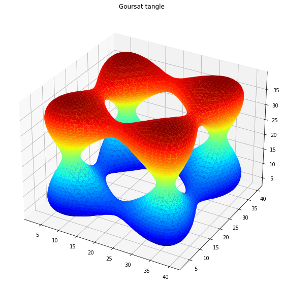

# Testing Matplotlib with complex 3D surfaces 

 $\textcolor{#246EAA}{\textsf{Getting familiar with Matplotlib after using Matlab for over 20 years.}}$
 $\textcolor{#246EAA}{\textsf{We test Matplotlib with complex 3D surfaces.}}$

 $\textcolor{#246EAA}{\textsf{The initial motivation for this work was to develop advanced sensor array beamforming algorithms with Python }}$ 
 $\textcolor{#246EAA}{\textsf{and complex Noise Reduction algorithms with Machine Learning or Deep Learning.}}$ 
 $\textcolor{#246EAA}{\textsf{The design of optimal sensor arrays requires plotting 3D beampatterns for visualizing and testing the performance of beamforming algorithms.}}$  
 $\textcolor{#246EAA}{\textsf{Animations are a plus.}}$   
 $\textcolor{#246EAA}{\textsf{Then we wondered which Matplotlib modules could replace simple Matlab functions for plotting 3D implicit surfaces and polyhedrons.}}$

**Part I: 3D curves and surfaces defined with Parametric systems.** 

https://github.com/DrStef/Testing_Matplotlib/blob/main/PARTI_Testing_Matplotlib_3D_curves_surfaces_v5.ipynb

**Part II: 3D surfaces defined with implict equations: F(x,y,z)=0.**

https://github.com/DrStef/Testing_Matplotlib/blob/main/PARTII_Testing_Matplotlib_3D_implicit_surfaces_v5.ipynb

**Part III: Polyhedrons and star-shaped polyhedrons.**

https://github.com/DrStef/Testing_Matplotlib/blob/main/PARTIII_Testing_Matplotlib_3D_Polyhedrons_v3.ipynb

**Part IV: 3D surfaces - Animations.** 

https://github.com/DrStef/Testing_Matplotlib/blob/main/PARTIV_Testing_Matplotlib_3D_Animations_v2.ipynb

Stephane D.  December 2022. 

