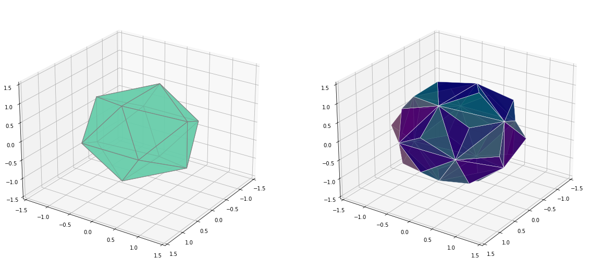

# Testing Matplotlib with complex 3D surfaces 

We test Matplotlib and Python with complex 3D surfaces and find the simplest method for plotting them. 
 
 
The initial motivation for this work was to develop advanced sensors array beamforming algorithms with Python and complex Noise Reduction algorithms with Machine Learning or Deep Learning.   
The design of optimal sensors arrays requires plotting 3D beampatterns for visualizing and testing the performance of beamforming algorithms. Animations are a plus. 
 
 
Then we wondered which Matplotlib modules could replace simple Matlab functions for plotting 3D implicit surfaces and polyhedrons. 

### <ul> **Part I: 3D curves and surfaces defined with Parametric systems.** </ul>

 #### <ul><ul>[3D Parametric systems](https://github.com/DrStef/Testing_Matplotlib/blob/main/PARTI_Testing_Matplotlib_3D_curves_surfaces_v5.ipynb)</ul></ul>

###  <ul> **Part II: 3D surfaces defined with implicit equations: F(x,y,z)=0.**  </ul>

 #### <ul><ul>[3D Implicit surfaces](https://github.com/DrStef/Testing_Matplotlib/blob/main/PARTII_Testing_Matplotlib_3D_implicit_surfaces_v5.ipynb)</ul></ul>

### <ul> **Part III: Polyhedrons and star-shaped polyhedrons.**   </ul>

 #### <ul><ul>[Polyhedrons](https://github.com/DrStef/Testing_Matplotlib/blob/main/PARTIII_Testing_Matplotlib_3D_Polyhedrons_v3.ipynb)  </ul> </ul>

###  <ul>  **Part IV: 3D surfaces - Animations.**  </ul>

 #### <ul><ul>[3D surfaces - Animations](https://github.com/DrStef/Testing_Matplotlib/blob/main/PARTIV_Testing_Matplotlib_3D_Animations_v2.ipynb)  </ul> </ul> 
 
 

Stephane D.  December 2022. 

